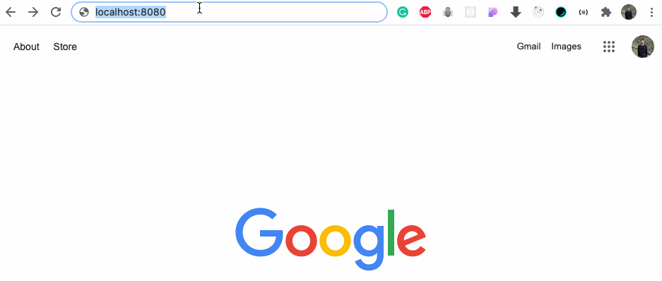
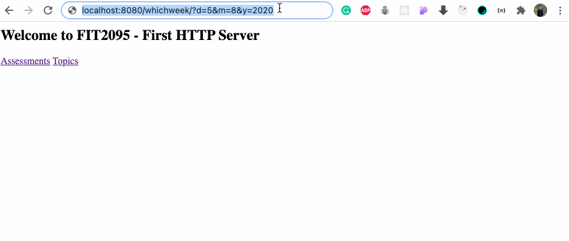

# FIT2095 Lab Task Week 2

## Tasks:
1.  An HTTP server that serves clients requests on port 8080.  **(4m)**
2.  index.html that contains two hyperlinks to two different pages:  **(2m)**
    1.  Assessments.html: display the four assessments we have in the unit.
        1.  example:  [http://localhost:8080/assessments](http://localhost:8080/assessments)
    2.  Topics.html: display the 12 weeks topics
        1.  example:  [http://localhost:8080/topics](http://localhost:8080/topics)
3.  404.html: display an error message for unknown requests  **(1m)**
    1.  example:  [http://localhost:8080/testerror](http://localhost:8080/testerror)



4.  a URL endpoint that accepts three parameters (day, month, year) and responds with:  **(3m)**
    1.  The current week since the first day of semester 2 which is the 26th of July 2021.
    2.  An error message if the input date is before the first day of the semester.
    3.  An error message if the input date is after week 14.
    4.  example: [http://localhost:8080/whichweek/?d=5&m=8&y=2020](http://localhost:8080/whichweek/?d=5&m=8&y=2020)

All four pages must have a link to the home page (index.html)



## Extra tasks:
1. Add a new end point "localhost:8080/help" that will send back help.html file.
2. Change the port number from 8080 to 5050.


## Access Locally

Prerequisites:

- Node: https://nodejs.org/en/download/

- npm: https://nodejs.org/en/download/

To run the app locally, please follow the steps below:

1. Clone the repository
```
https://github.com/KarlokZhang/FIT2095-LabTasks.git
cd Week2_Lab
```
2. Install dependencies
```
npm install
```
3. Run the server
```
node server.js
```
4. Now access the page at http://localhost:8080